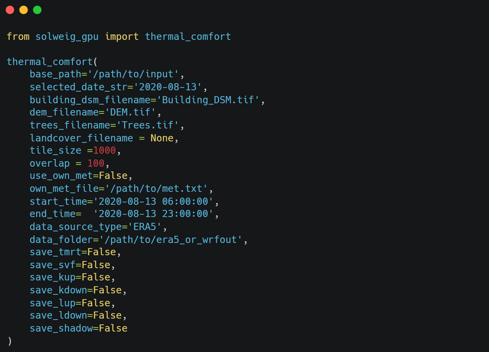

# Summary

Urban digital twins need a number of interlinked datasets and models that are able to represent the urban environment and are of value to the end user. As part of the urban heat mitigation studies, thermal comfort estimate is a desired outcome at the city scale. Here we present Solar and LongWave Environmental Irradiance Geometry-Graphics Processing Unit variant (SOLWEIG-GPU) as a Python package that provides a single-line code, command-line interface (CLI), and a graphical user interface (GUI) for executing the SOLWEIG model version 2022a on both GPUs and central processing units (CPUs). The package facilitates human thermal comfort modeling at meter-scale resolution across city-scale domains by computing key variables such as sky view factor (SVF), mean radiant temperature (TMRT), ground shading, and the universal thermal climate index (UTCI). The package installation instructions are available at  https://pypi.org/project/solweig-gpu/, and sample data for running the model are archived on Zenodo (temporary link: https://utexas.box.com/s/8fctqicidr5cup8kj3tk53jd444pow6z). 

# Statement of need

The original SOLWEIG model [@lindberg2018umep] was developed to calculate TMRT over small geographical areas in cities (typically an urban block). At this spatial scale, based on the time required for computation, the model could be run on CPUs. However, for city-scale thermal comfort estimation and forecasting applications, the model can be accelerated using a GPU. Specifically, the calculation of the SVF (which is the most time-consuming step), TMRT, and UTCI can be processed on a GPU. Currently, there is a tool that computes SVF on GPU, but it uses Python to read the inputs and write the output rasters, while the SVF calculation on GPU is done by interfacing with a C-language code [@li2021gpu]. Thus, there was a need for a Python-based end-to-end framework to run SOLWEIG on a GPU. SOLWEIG-GPU bridges this gap by providing user-friendly single-line Python code, CLI, and GUI to calculate the variables required for assessing human thermal comfort. The GPU is autoselected if available, else the model can still run on a CPU. In addition to being a stand-alone package, since SOLWEIG-GPU is fully Python-based, it is readily implementable in the Urban Multi-scale Environmental Predictor (UMEP) urban modeling framework [@lindberg2018umep] within QGIS. SOLWEIG-GPU makes it possible to calculate city-scale thermal comfort at very high resolutions (e.g., at 2 meters) within a few hours, which previously took multiple days to compute on CPUs.

# Functionality 
SOLWEIG-GPU has been tested on Ubuntu (on NVIDIA A6000 and CPU), Windows 11 (on NVIDIA RTX 4600 and CPU), and MAC OS (on CPU), and also on Texas Advanced Computing Center’s (TACC) Lonestar-6 and Vista clusters (on NVIDIA A100 and H100 GPUs). SOLWEIG-GPU requires the following inputs: (i) Building digital surface model (DSM) that includes both buildings and terrain height, (ii) Digital elevation model (DEM) that is the bare ground elevation, (iii). Tree or vegetation DSM that only represents the vegetation height (iv). UMEP style land cover (optional), and (v) meteorological forcing. Allowed land cover types are asphalt or paved, buildings, grass, bare soil, and wate,r but users can add their own land cover types provided they know the thermal properties for the land surface (e.g., albedo and emissivity). All the input datasets must be of the same spatial resolution, projection, and spatial extent. The recommended projection is the Universal Transverse Mercator (UTM). For example, Austin, Texas, comes under WGS 84/UTM zone 14N or EPSG: 32614. Necessary meteorological variables are (i) 2-meter air temperature (℃), (ii) relative humidity (%), (iii) barometric pressure (kPa), (iv) near-surface wind speed (m/s), (v) downwelling shortwave radiation (W/m2) and (vi) downwelling longwave radiation (W/m2). 

Figure 1 shows the workflow of SOLWEIG-GPU, and a detailed description of SOLWEIG-GPU functionalities are as follows:
  1. For larger geographical domain simulations, SOLWEIG-GPU can divide the domain into smaller tiles as shown in Figure 1. The size of tiles can be set using the variable tile_size. tile_size should be selected based on the RAM availability on the GPU. If a chosen tile_size is greater than the input raster dimensions, a single tile, which is the same as the original raster, will be created.
  2. GPU is autoselected if available for GPU-based calculations, shown in Figure 1. If the GPU is not available, all the tasks can still be performed fully on a CPU. If torch.cuda.is_available() returns ‘True’, the simulations will be performed on a GPU.
  3. The calculations of wall height and aspect (wall directional orientation) are faster on the CPU as they use an i and j  indices to loop through the input rasters. Thus, we have parallelized this operation. This calculator is performed for different tiles on multiple CPUs at once.
  4. SVF, TMRT, UTCI, and ground shadows are computed on the GPU, if available. Additionally, the model can output shortwave and longwave radiation in both upward and downward directions. The users can select the required output variables from SOLWEIG-GPU, but UTCI is output by default. Note that the calculation of UTCI uses wind speed from the meteorological forcing, but more advanced methods to calculate wind speeds in urban areas are available [@bernard2023urock]. 
  5. Land cover classes can be optionally provided to the model that are used to set up the grid for the surface thermal properties [@lindberg2016ground].
  6. SOLWEIG-GPU can only work with hourly data presently. However, the time period of the simulation is based on the meteorological forcing data provided. SOLWEIG-GPU can create separate forcing for all the tiles created based on the selected tile_size. The model can accept the meteorological forcing in three ways: (i) Output from the MetProcessor tool in UMEP, (ii) Gridded ERA-5 reanalysis, and (iii) Gridded output from the Weather Research and Forecasting (WRF) model. When the gridded datasets are used for forcing, if the grid spacing of the gridded dataset is less than the tile size, then forcing for the individual tiles is the average value of the pixels from the gridded dataset that fall within the tiles. Else, the nearest neighbor of the gridded dataset to the tile is used.

# Usage 

For demonstration of the code and to familiarize oneself with the input data requirements/format, the sample dataset on Zenodo can be used. SOLWEIG-GPU can be run in three different ways depending on the code adaptation:
  1. Python or “call within your Python code”: This is useful if a user wants to calculate the required variables within their Python script or wants to directly post-process the outputs from SOLWEIG-GPU (e.g., plot or run statistical analysis). In the example shown in Figure 2: selected date is the day of the simulation, landcover = 0 implies that the land cover dataset is not used (landcover = 1 if land cover dataset is used and landcover_filename must be supplied), tile_size is set to 3600 meaning the tiles will be 3600 x 3600 pixels, meteorological data created using UMEP was used (thus use_own_met = True), use_own_file is the path to the UMEP meteorological forcing (in .txt format), and lastly only UTCI and sky-view factor outputs were saved. The rest of the inputs shown in Figure 2 are optional if use_own_met = True. However, if gridded datasets are to be used, use_own_met = False. Additionally, the source of the gridded files must be mentioned (ERA5 or WRFOUT), and the folder path where gridded data is stored should be given in data_folder. The start_time and end_time are the first and last hours of data in the gridded datasets in UTC. 

  2. Using CLI: This method is useful if the users want to run SOLWEIG-GPU on the terminal or using functions like os.system(). Figure 3 shows an example of command-line interface operation. The explanation of the code in Figure 3 follows Figure 2.

  3. Using GUI: This is the simplest way of running SOLWEIG-GPU. To launch the GUI, users must type solweig_gpu in the command line, and a simple and self-explanatory GUI, as shown in Figure 4, will pop up.

When ERA-5 is chosen for meteorological forcing, the model expects two files in the data_folder that have instantaneous and accumulated data variables. Typically, these files are named ‘data_stream-oper_stepType-accum.nc’ and ‘data_stream-oper_stepType-instant.nc’. The mandatory variables, along with the variable names in the ERA-5 dataset are as follows: 
  1. Instantaneous variables: 2-meter temperature (t2m), 2-meter dew point temperature (d2m), and winds in meridional and zonal directions (u10 and v10).
  2. Accumulated variables: Surface downwelling shortwave radiation (ssrd) and surface downwelling longwave/thermal radiation (strd).
The selected outputs will be written in a new folder named ‘Outputs’. In this folder, there will be folders for each tile that contain the selected outputs. For TMRT, UTCI, shortwave, and longwave radiations in up and down directions and shadows, a raster will be created that will have n bands, where n is the number of hours of simulation (n = 24 for a day simulation). For SVF, a single band raster will be created as the SVF does not change with time and only depends on buildings, trees, and terrain elevation. 

# Applications
We present one notable application of SOLWEIG-GPU. In this first application, thermal comfort processing time was critical. The requirement was to estimate the day-ahead thermal comfort along the 2024 Paris Olympics marathon track, which was made possible using GPU acceleration. SOLWEIG-GPU was initialized on the previous day using the  ECMWF Integrated Forecasting System (IFS) day-ahead meteorological forecasts and UT-GLOBUS building dataset [@kamath2024globus]. The entire simulation of thermal comfort was completed in about 6 hours. Figure 5 shows a 3-D map of Paris where the basemap is the UTCI and the marathon track is shown as a black solid line.

# Comparison with SOLWEIG - CPU
UTCI simulations were run with different tile sizes, both on CPU and GPU, using the SOLWEIG-GPU package. The CPU-based simulations were run on a Windows 11 machine with a 10th generation Intel Core i7 (i7-10700) and 16 Gigabytes (GB) of Random Access Memory (RAM). The GPU-based simulations were run on an Ubuntu machine with NVIDIA A6000 GPU with 50 GB RAM. Table 1 below reports the average time taken for the UTCI calculations (mean of 4-5 simulations with the same tile size). Note that Table 1 only reports the time for SVF and UTCI calculations for different tile sizes, as the calculations for wall height and aspect are parallelized and CPU-based (Figure 1).

Table 1. Comparison of time taken for UTCI computation using CPU and GPU-based machines for different tile sizes.

| Tile size     | CPU-based               | GPU-based | GPU acceleration |
|---------------|-------------------------|-----------|------------------|
| 1000 x 1000   | 1187 seconds (0.33 hrs) | 47 seconds| ~25×             |
| 1500 x 1500   | 3322 seconds (0.92 hrs) | 105 seconds| ~32×            |
| 2000 x 2000   | 6487 seconds (1.8 hrs)  | 158 seconds| ~41×            |

# Citations

Citations to entries in paper.bib should be in
[rMarkdown](http://rmarkdown.rstudio.com/authoring_bibliographies_and_citations.html)
format.

If you want to cite a software repository URL (e.g. something on GitHub without a preferred
citation) then you can do it with the example BibTeX entry below for @fidgit.

For a quick reference, the following citation commands can be used:
- `@author:2001`  ->  "Author et al. (2001)"
- `[@author:2001]` -> "(Author et al., 2001)"
- `[@author1:2001; @author2:2001]` -> "(Author1 et al., 2001; Author2 et al., 2002)"

# Figures

Figures can be included like this:

and referenced from text using \autoref{fig:example}.

Figure sizes can be customized by adding an optional second parameter:
{ width=20% }

# Acknowledgements

We acknowledge contributions from Brigitta Sipocz, Syrtis Major, and Semyeong
Oh, and support from Kathryn Johnston during the genesis of this project.

# References
